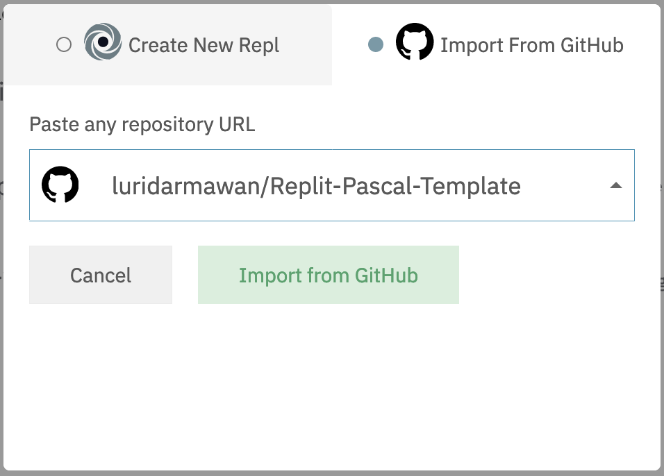
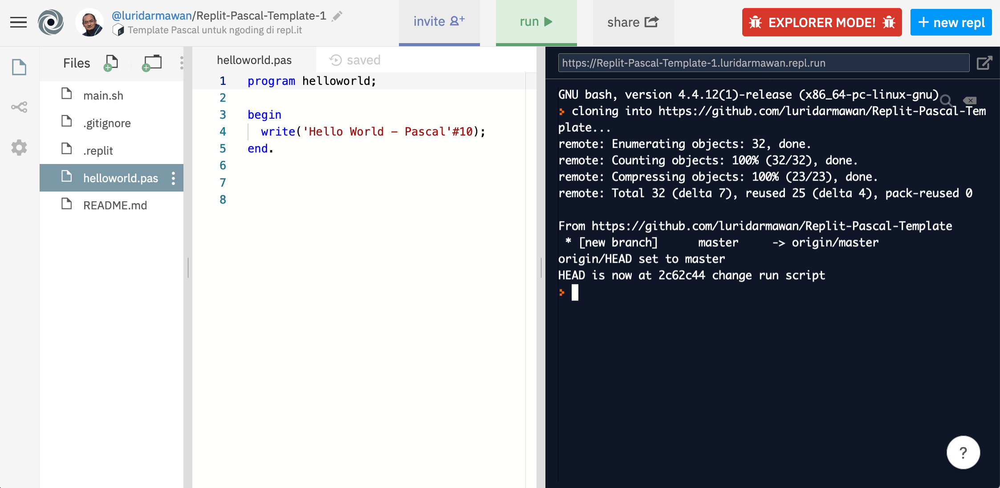

# Template Pascal untuk ngoding di repl.it

## Cara penggunaan

1. Buat Repl baru dengan klik tombol `new repl` 
2. Pilih *Import from Github*,
3. Salin dan tempel url repositori ini `https://github.com/luridarmawan/Replit-Pascal-Template`, kemudian tap tombol *Import from GitHub*. 
4. Tunggu beberapa saat, Repl.it akan membuatkan environment IDE untuk anda.
5. Anda bisa langsung menjalankan file `helloworld.pas` dengan menekan tombol *run* di bagian atas.

## Catatan

[Repl.it](http://repl.it) ... ... .. .. 

*Selamat mencoba*

### referensi:

- [Ngoding Pascal di REPL.IT](https://www.pascal-id.org/news/345/ngoding-pascal-di-repl.it)
- [Repl.it](https://repl.it)

